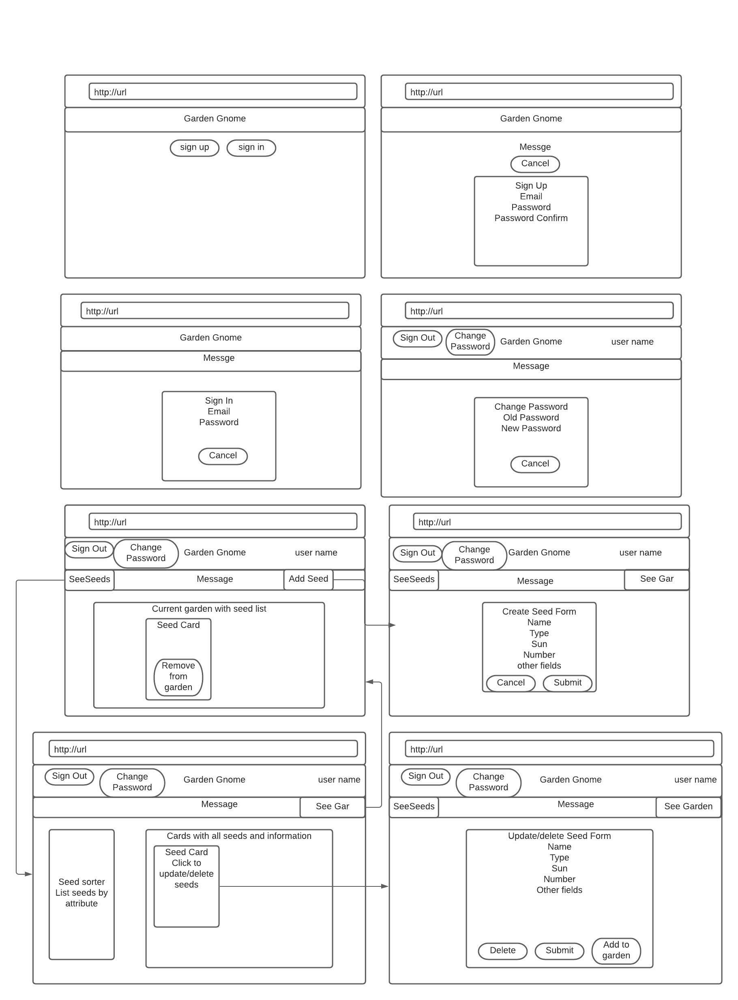
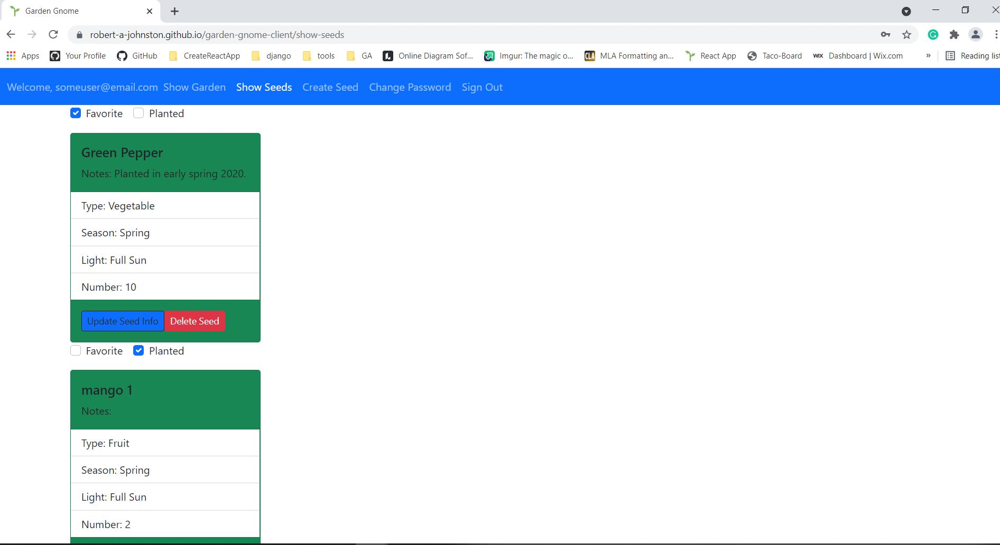

# Garden Gnome: A Description
Garden Gnome is an application that lets a user sign in and track the seeds that they have.  Seeds can be added, updated, and removed.  The user can see what seeds they have and what seeds have been planted in the garden.  The user can see the information about each seed, like type, planting season, and sun requirements.  The user can also mark seeds as favorite and add additional notes about each seed.

# IMPORTANT LINKS
- Garden Gnome Deployed Client: [DEPLOYED CLIENT](https://robert-a-johnston.github.io/garden-gnome-client/)
- Garden Gnome API Repo: [API REPO](https://github.com/robert-a-johnston/garden-gnome-API) 
- Garden Gnome API Deployed: [Deployed API](https://garden-gnome-api.herokuapp.com)
# PLANNING STORY
The developer started planning by looking for a problem that needed to be solved.  There was a drawer of plant seeds but the developer did not know what exactly was in the drawer.  They also wanted to keep track of the information about each type of seed and if they were planted in the garden currently.
In order to fix this problem the developer decided to create a digital seed repository. User stories were created. The developer looked for the most basic functionality of the seed that would address as many of the user stories as possible.  Then the ERD diagram and wire-frames were created.  The developer decided that the best type of data-base long term would be a SQL database and decided to use Django and postgresSQL for the server, and the React framework for the client.  The developer set a time table that they felt was realistic to complete the project in the time alloted.  The developer then wrote sudo-code to determine the flow of data and how data would be retrieved.  Then the developer began writing code.

# USER STORIES
1.	As a user I should be able to sign-up.
2.	As a user I should be able to sign-in.
3.	As a user I should be able to sign-out.
4.	As a user I should be able to change my password.
5.	As a user I should be able to add, update and delete a seed to my list.
6.	As a user I should be able to add and delete seeds from my garden.
7.	As a user I should be able to see all my seeds.
8.	As a user I should be able to see the seeds in my garden.
9.	As a user I should be able to sort through my seeds by different attributes, like amount of sun required, season, and type.

# TECHNOLOGIES USED
- Javascript
- React
- HTML/CSS
- React Bootstrap
  
# FUTURE DEVELOPMENT PLANS
- Add seed sorter.
- Add design tweaks.
- Add more than one garden and track what seeds are in each garden.

# WIRE-FRAMES

# SCREEN SHOT

